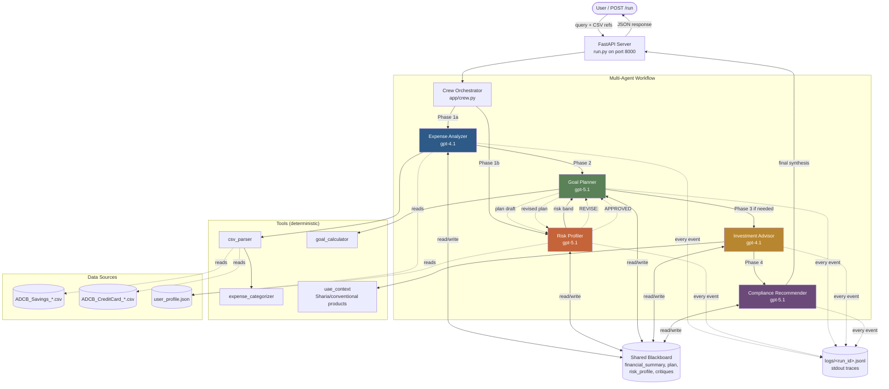

# Architecture — Karim's Money

**Use Case ID:** 24 — Personal Finance Assistant for UAE Residents
**Difficulty:** Medium
**Submission:** G42 Agentathon

---

## 1. Problem and User

### 1.1 Problem Statement

UAE residents — particularly expat households who make up ~88% of the population — face concentrated financial pressure that off-the-shelf budgeting apps do not address:

- **Visa dependency**: job loss triggers a 30-day visa cancellation window, making emergency runway a survival metric, not a vanity metric.
- **Heterogeneous income & cost structure**: high rent (typically 25-40% of income), school fees, family remittance, vehicle financing, and 8-12 active subscriptions per household.
- **Sharia-compliance optionality**: a meaningful share of users need investment guidance that respects faith-based constraints.
- **Generic robo-advisors give the wrong advice**: an Egyptian father of one in JVC Dubai has structurally different risk tolerance than the same person would in London or Cairo, and standard 60/40 model portfolios ignore the visa-runway constraint entirely.

The persona we build for is **Karim Mansour**, 36, Egyptian expat in Dubai, Marketing Manager, AED 22,556/month, married with one child. His financial data is synthetic but representative.

### 1.2 Stakeholder Need

Karim needs answers to three categories of real-life question:

1. **Goal feasibility** — "Can I afford X in Y months?"
2. **Timing & budgeting** — "When and how should I do X?"
3. **Optimization** — "Where can I cut without hurting my family's quality of life?"

He needs answers that are (a) grounded in his actual transactions, (b) UAE-specific in their product references, (c) sensitive to his visa-runway risk, and (d) auditable.

---

## 2. Agent Architecture

### 2.1 System Diagram

This is **not a linear pipeline**. The critical loop is between **Goal Planner** and **Risk Profiler**, who exchange plan drafts and critiques until either the plan is approved or the maximum revision count (2) is reached. The Compliance Recommender has final veto authority.

### 2.2 Agent Roles

| Agent | Model | Responsibility | Decision Authority |
|---|---|---|---|
| **Expense Analyzer** | gpt-4.1 | Parse ADCB CSVs, categorize spend, compute monthly financial summary | Categorization rules; flags high-discretionary categories |
| **Risk Profiler** | gpt-5.1 | Compute risk band (conservative/moderate/aggressive), surface red flags (visa runway, buffer ratio), challenge aggressive plans | Critique authority over Goal Planner's plans |
| **Goal Planner** | gpt-5.1 | Translate user query into a dated, costed plan; classify query type (goal_purchase / vacation / cut_expenses); revise on critique | Plan owner; revises in response to critique |
| **Investment Advisor** | gpt-4.1 | Match risk band to UAE-specific products (ADCB Active Saver, DIB Sukuk, Sarwa portfolios), respect Sharia toggle when present | Product selection within risk band |
| **Compliance Recommender** | gpt-5.1 | Synthesize the final answer; append SCA-mandated disclaimer; veto any plan that violates emergency-fund minimums | Final output authority; veto |

### 2.3 Workflow Phases

The orchestrator runs four phases. Phase boundaries are decision points where the system can branch.

**Phase 1 — Independent Analysis (parallel-eligible)**
- Expense Analyzer reads CSV transactions, produces `financial_summary` (income, fixed costs, variable spend, savings rate, buffer months).
- Risk Profiler reads `user_profile.json` + `financial_summary`, produces `risk_profile` (band, score, red flags, minimum emergency fund).

**Phase 2 — Plan + Critique Loop (the heart of the system)**
1. Goal Planner reads `financial_summary` + `risk_profile`, classifies the query (`goal_purchase` / `vacation` / `cut_expenses` / `general`), drafts an initial plan.
2. Risk Profiler critiques the plan against three concrete checks: would it (a) drop buffer below 3 months, (b) push debt-to-income unhealthy, (c) ignore upcoming fixed costs.
3. If `REVISE`, Goal Planner produces a revised plan acknowledging the critique.
4. Risk Profiler re-checks; either `APPROVED` or another revision (max 2).

**Phase 3 — Investment Recommendation (conditional)**
Triggered only when the plan involves savings deployment (not for pure cost-cutting queries). Investment Advisor selects 3 products matching the user's risk band, respecting Sharia preference.

**Phase 4 — Compliance Synthesis & Veto**
Compliance Recommender writes the final user-facing answer combining all findings, in the required structure: direct answer → 2-3 key findings → action plan → SCA disclaimer. It can veto any plan that would breach the emergency-fund minimum and require the loop to restart.

### 2.4 What Makes This Multi-Agent (not a chain)

Three things demonstrate genuine multi-agent collaboration in the trace:

1. **Bidirectional information flow** between Goal Planner and Risk Profiler — the Profiler does not just consume the Planner's output, it sends `REVISE: <concern>` back, and the Planner revises.
2. **Shared blackboard state** — every agent reads and writes to `app/memory/blackboard.py`. Decisions made by upstream agents (the risk band, the buffer status) gate downstream behavior.
3. **Conditional branching** — Phase 3 only runs for goals involving deployment of capital; pure cost-cutting queries skip it. Phase 4 can roll back to Phase 2 if Compliance vetoes.

Every event is recorded in `logs/<run_id>.jsonl` with the schema `{agent_name, action, target_agent, output_summary, status, timestamp}`, satisfying the hackathon's required trace format.

---

## 3. Tools and Frameworks

| Layer | Choice | Why |
|---|---|---|
| Multi-agent framework | **CrewAI** | Native LLM-agent abstraction; integrates with OpenAI-compatible APIs (Compass). |
| LLM client | **LiteLLM via CrewAI** | Routes Compass calls through OpenAI-style interface; supports retries and tracing. |
| Web framework | **FastAPI + Uvicorn** | Required `POST /run` endpoint, async with `asyncio.to_thread` for CrewAI's synchronous calls. |
| Validation | **Pydantic v2** | `RunRequest` / `RunResponse` schemas. |
| Data parsing | Custom `app/tools/csv_parser.py` | ADCB CSV format is non-standard (6 header rows, DD/MM/YYYY dates). |
| Categorization | Rule-based + UAE merchant dictionary (`app/tools/expense_categorizer.py`) | Deterministic, auditable. |
| UI | Vanilla HTML/CSS/JS (no React) | No build step, smaller surface for Docker, easier to demo. |
| Voice input | **Web Audio API → WAV → Compass `whisper`** | Browser captures raw PCM, encodes WAV in-page, sends to backend; backend forwards to Compass. |
| Persistence | Flat JSON files (`data/history.json`) | Visible in VS Code, easy for judges to inspect, no DB to install. |

### 3.1 Compass Models Used

| Model | Used By | Purpose |
|---|---|---|
| `gpt-4.1` | Expense Analyzer, Investment Advisor | Pattern recognition, product matching |
| `gpt-5.1` | Risk Profiler, Goal Planner, Compliance Recommender | Higher-stakes reasoning, critique, compliance synthesis |
| `whisper` | `/transcribe` endpoint | Voice-input transcription (multimodal bonus) |
| `text-embedding-3-large` | Reserved (not currently used; documented for future RAG over financial guidance corpus) | — |

All calls route through `OPENAI_BASE_URL=https://compass.core42.ai/v1` with the OpenAI Python SDK. No direct OpenAI / Anthropic / Google API calls.

---

## 4. Data Sources

### 4.1 Synthetic Bank Statements

Two CSV files in `data/`, both in ADCB's actual exported format:

- `ADCB_Savings_KarimMansour.csv` — 92 transactions over 9 months (Sep 2025 – May 2026). Opening AED 32,000 → closing AED 36,394. Reveals a thin 2.2-month emergency buffer.
- `ADCB_CreditCard_KarimMansour.csv` — 519 transactions averaging AED 6,553/month spend, paid off monthly. Includes 8 subscriptions, heavy Talabat usage, family activities, and a Georgia vacation in Dec 2025.

These were generated programmatically (`scripts/generate_csvs.py`) using realistic UAE merchant names (Carrefour, ADNOC, Talabat, Du, DEWA, Stepping Stones Nursery, etc.). Total dataset is well under the 500MB static-data limit (~150KB).

### 4.2 User Profile

`data/user_profile.json` — static persona file with age, marital status, dependents, employment tenure, residency status, monthly salary, employer industry, and active loans. Read by the Risk Profiler.

### 4.3 Production Data Handling

The system already supports replacing transactions via `POST /upload-csv`. In production, this would be replaced by a bank-OAuth integration (Open Banking UAE when available, or screen-scrape via Plaid-like service) — no architectural change required, just a new ingestion adapter.

---

## 5. Failure Handling and Fallback

The system is designed to fail gracefully at every layer:

| Failure Mode | Detection | Fallback |
|---|---|---|
| Compass API key missing | `Config.is_live()` check at startup | Switch to `SAMPLE_MODE=true`, all agents produce deterministic templated responses from real CSV math |
| Compass quota / rate limit | LiteLLM raises within `_maybe_call_agent` | Fall through to the sample-mode response for that agent only — other agents continue with real LLM calls |
| Compass timeout | 600s ceiling on POST /run | HTTP 504 returned to client; partial trace preserved in `/logs/` |
| CSV file malformed or missing | `csv_parser.py` raises `FileNotFoundError` | API returns HTTP 404 with a clear hint |
| User voice recording empty/short | Backend `len(audio_bytes) < 500` check | HTTP 400; UI shows "No speech detected" message |
| Compass returns "you" hallucination for silence | Frontend detects in `handleRecordingStop` | UI shows "No speech detected"; user can retry |
| CrewAI sync call inside async loop | Wrapped in `asyncio.to_thread()` | Agent execution runs in worker thread; FastAPI event loop unaffected |
| Critique loop infinite recursion | Hard cap of 2 revision rounds + heuristic short-circuit when "REVISION" already in plan text | Loop exits with whatever plan exists; flagged in trace |
| CrewAI telemetry SSL error | `CREWAI_TELEMETRY_OPT_OUT=true` in `.env` | Telemetry disabled; no impact on agent reasoning |

Every failure path is logged to `logs/<run_id>.jsonl` so judges can audit how the system degraded.

### 5.1 SAMPLE_MODE — A First-Class Citizen

`SAMPLE_MODE=true` is not just an evaluator convenience. It is a fallback path that produces a **complete, useful answer** even with zero Compass access. The deterministic responses are computed from the actual CSV data (the financial summary is real math) and then rendered through string templates that mimic the LLM agents' voices. This means:

- A judge running the system without a Compass key still gets a coherent end-to-end demo.
- A user hitting Compass quota mid-day still gets a usable answer.
- Sample-mode and live-mode outputs are structurally identical (same JSON schema), so the UI works the same way.

---

## 6. Observability

- `logs/<run_id>.jsonl` — one file per `/run` invocation, append-only JSONL trace.
- Each line: `{"agent_name", "action", "target_agent", "output_summary", "status", "timestamp", ...}`.
- Critique events have `action: "critique"` and `target_agent` of the agent being challenged.
- Revisions have `action` containing "revis" and reference the original critique.
- The UI exposes the full trace via a "View full agent trace" modal with a Copy JSON button — judges can grab the JSONL directly from the UI.
- The trace structure follows the recommended format in the G42 starter docs (multi-agent app starter guide section 9.3).

---

## 7. Design Decisions and Trade-offs

| Decision | Rationale | Trade-off |
|---|---|---|
| Two-tier model split (gpt-4.1 for routine, gpt-5.1 for reasoning) | Cost/latency optimization; the critique step is where reasoning quality matters most. | Slight added complexity in agent definitions. |
| Heuristic critique + LLM amplification (vs. pure LLM critique) | Some critiques are not judgement calls (buffer < 3 months IS a problem, period). Hard-coding those prevents the LLM from being talked out of a correct critique by a confident plan. | Less "natural" critique text; mitigated by routing the heuristic through the LLM for phrasing. |
| Sharia-compliant products as an explicit category, not a separate agent | Pragmatic: Sharia compliance is a filter on the product catalog, not a separate reasoning task. | A dedicated Sharia agent would be more impressive but would not produce better answers given current product diversity. |
| JSON file for history (vs. SQLite, vs. vector DB) | Visibility, simplicity, no install. The history is also reusable as the source for `output_examples/*.json`. | No semantic search ("find similar past questions") — explicitly out of scope. |
| Browser-side WAV encoding for voice | Compass Whisper rejects `webm`; manual PCM-to-WAV in JS avoids any backend audio dependency (no ffmpeg). | Slightly more frontend code; mitigated by isolating it in a single 60-line function. |
| `data/history.json` as both a UX feature and a submission artifact | Single source for both the demo (sidebar) and the `output_examples/*.json` requirement. | Schema coupling between UX and submission — kept stable by versioning the entry shape. |

---

## 8. Known Limitations

1. **Synthetic data**: Karim is fictional. The system has never been tested against real ADCB statements (the CSV format is realistic but anonymized).
2. **English-only**: Whisper transcribes Arabic but the agents have not been prompted for Arabic responses. A real UAE product would need bilingual support.
3. **Single user profile**: No multi-tenant support yet; the `user_profile.json` is global. Would need authentication + per-user data isolation.
4. **No real-time bank sync**: Statements are static CSVs uploaded by the user. Open Banking UAE integration is the obvious next step.
5. **Limited investment product catalog**: 9 products across savings / fixed-income / diversified categories. A real product would integrate with ADCB / Emirates NBD / Sarwa / etc. APIs.
6. **No tax or zakat optimization**: Out of scope but commonly requested.
7. **The critique loop is capped at 2 rounds**: This is a guard against runaway iteration but may bail out before the optimal plan in edge cases.

---

## 9. Future Work

**Short term (post-hackathon, weeks)**
- Bilingual support (English + Arabic) via Compass — both agent prompts and UI strings.
- Real-time bank sync via Open Banking UAE pilot APIs.
- Per-user authentication and data isolation.
- RAG over a UAE-specific financial guidance corpus (SCA publications, ADCB / DIB educational content) using `text-embedding-3-large`.

**Medium term (months)**
- Push notifications for upcoming fixed-cost events (rent cheque, school fees) and unusual spending.
- Goal milestone tracking with progress nudges.
- Integration with UAE Pass for identity-verified onboarding.
- A "household" mode where two adults share a financial profile but maintain individual privacy boundaries.

**Long term (productionization path)**
- Move from JSON-file persistence to a managed datastore (DynamoDB or similar in AWS Middle East region).
- Move from CrewAI to a more deployment-friendly orchestration (the same agent definitions are portable to LangGraph if scaling demands).
- SOC 2 / ISO 27001 readiness work — current code has no PII handling primitives.
- Regulatory: register as a SCA-licensed robo-advisory before any real money flows. The compliance disclaimer in every output is a placeholder for this regulatory path.

---

## 10. Deployment Considerations

The submitted Docker image is the deployment target for the hackathon evaluator. For production:

- **Stateless**: The backend is stateless except for `data/history.json` and uploaded CSVs. Both should move to object storage in production.
- **CPU-only**: All Compass calls are external; no GPU needed. Runs comfortably in a 1 vCPU / 1 GB container.
- **Horizontally scalable**: Multiple replicas behind a load balancer would work without changes, once history moves out of the local filesystem.
- **Compass quota management**: A real deployment would need quota tracking per user and graceful degradation to sample mode when exhausted — the fallback path already exists.
- **Cost envelope**: Approximately 5,000 tokens per query at current pricing. Even at 100K queries/month, the Compass cost is well within the economics of a B2C personal-finance product.

---

*Submission Use Case 24 · Personal Finance · G42 Agentathon · June 2026*
